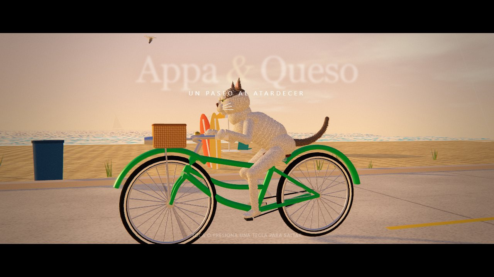
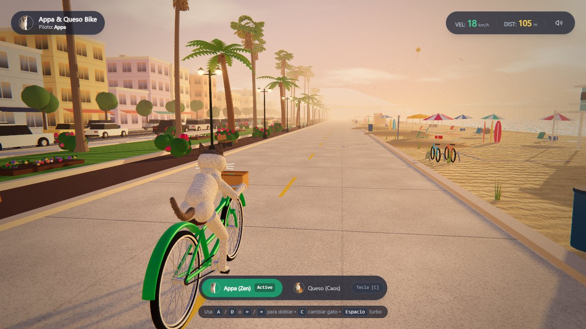
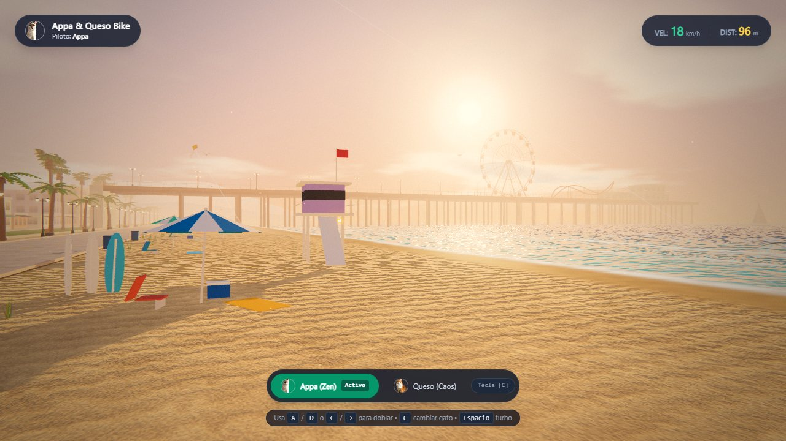
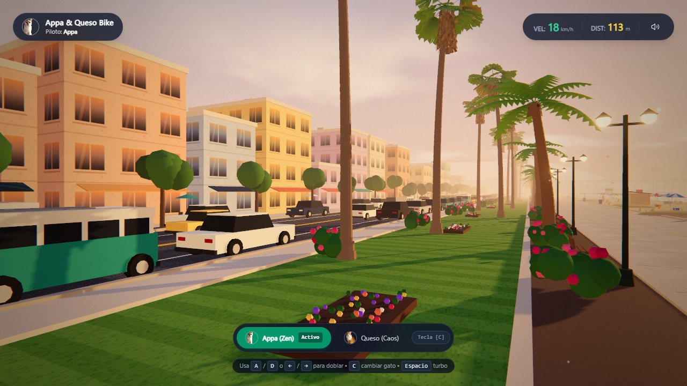
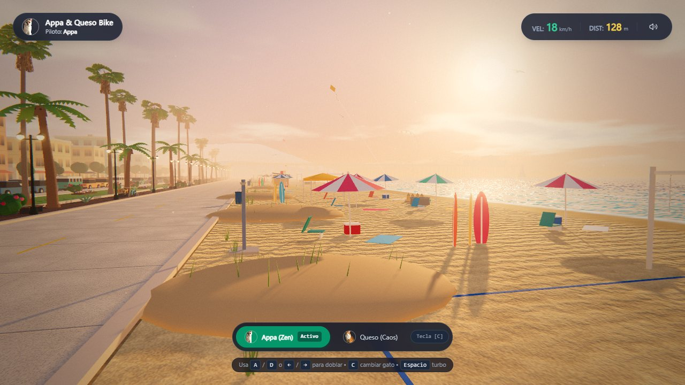

# Appa & Queso Bike 🐾🚲

> **An AI-First project.** Specified, built, verified and documented through an AI-native workflow:
> the product owner directs in plain language, AI coding agents (Claude Code) turn intent into
> specs, code, visual verification and docs. See [`ai/`](ai/README.md).

A cinematic, endless 3D bike ride along a **Southern-California beach at golden hour**, starring
two real cats — **Appa** (zen, cream-white with a tabby cap) and **Queso** (chaotic ginger tabby).
Everything you see and hear is **generated procedurally in the browser**: no 3D models, no texture
files, no audio files, no servers.



| | |
|---|---|
|  |  |
|  |  |

---

## 🤖 What "AI-First" means here

This isn't a project that *uses* an AI feature — it's a project **made the AI-native way**:

| Practice | How it shows up |
|---|---|
| **Spec-Driven Development** | [`ai/specs/`](ai/specs/README.md) is the source of truth (architecture, gameplay, rider, audio, HUD, world, rendering, QA). Code follows specs; specs change first. |
| **Intent → implementation** | Features start as plain-language intent ("the sides feel empty", "make the cats realistic") and are turned into specs + code by agents. |
| **Agent-run verification** | Every change is checked like a user would see it: strict types, unit tests, production build, **headless-browser screenshots from gameplay and debug cameras**, draw-call and frame-time measurements. |
| **Decision memory** | Non-obvious choices are recorded as ADRs in [`ai/decisions.md`](ai/decisions.md) so future agents don't re-litigate them. |
| **Living roadmap** | [`ai/roadmap.md`](ai/roadmap.md) — prioritised next features. |
| **Agent rules** | [`ai/README.md`](ai/README.md) — offline-only, batch everything, verify visually, shader safety, report faithfully. |

---

## ✨ Highlights

**Characters**
- Beach-cruiser bicycle built from real frame geometry; steering pivots on the **tilted head-tube
  axis**; drivetrain with a **2.6 gear ratio** (≈ 84 rpm cadence).
- **Two-bone analytic IK** keeps the cats' paws locked to pedals and grips every frame.
- **Shell-textured fur** with per-strand variation and speed-driven wind; blinking, ear and tail
  motion, upper-body rocking with each pedal stroke.

**World** — a Santa Monica / Venice cross-section
- Procedural sky (sun, clouds, distant mountains) baked into **image-based lighting**.
- Shader ocean with Fresnel reflections, HDR sun glint, organic breaking sets and a breathing
  foam line.
- A **Santa Monica-style pier you ride underneath**, with a Ferris wheel of 144 glowing bulbs and a
  roller coaster.
- Washingtonia fan palms, pastel beach-front buildings, a street with **moving traffic**, café
  tables, bougainvillea, lifeguard towers, volleyball, fire rings, surf shack, pelicans, sailboats,
  kites.

**Cinematics & feel**
- 9-second **camera-flight intro** with title card and letterbox.
- HDR post stack: bloom, film grade, vignette, grain, chromatic aberration, radial speed blur.
- **Generative ambient music** (Web Audio): lo-fi pad, keys, bass, reverb, ocean waves, breeze,
  distant gulls — soft, subtle, zero audio files.

**Performance engineering**
- Static scenery baked per material, the articulated rider **CPU-skinned into one draw call per
  material**, instancing for life/traffic → **408 → ~166 draw calls** with a much richer world.
- Device quality tiers + **adaptive resolution**.

---

## 🎮 Controls

| Action | Keyboard | Touch |
|---|---|---|
| Steer | `A` / `D` or `←` / `→` | Drag, or ◀ ▶ buttons |
| Turbo | `Space` | TURBO button |
| Switch cat | `C` | Appa / Queso pills |
| Sound | 🔊 button in the HUD | 🔊 button |
| Skip intro | Any key | Tap |

URL flags: `?nointro` (skip the intro) · `?quality=low|high` (force a quality tier).

---

## 🛠 Tech Stack
- **React 18 + Vite 5 + TypeScript (strict)**
- **Three.js r170** (custom shaders, `EffectComposer` post-processing)
- **Web Audio API** (generative soundscape)
- **Tailwind CSS** + Lucide icons
- **Vitest** for unit tests

## 🚀 Getting Started

```bash
npm install
npm run dev      # http://localhost:5173
npm test         # unit tests (IK math)
npm run build    # production bundle (~225 KB gzip)
```

## 📁 Project Structure

```
src/
├── app/                 # React shell (App, mount, styles)
├── lib/                 # bakeStatic, DynamicBatch (batching engines)
└── features/
    ├── game/            # engine, camera + intro, world, ocean, sky, pier, traffic, post FX, quality
    ├── cat-rider/       # bicycle rig, cat rig, IK math (+ tests), fur shells
    ├── hud/             # HUD + intro overlay
    └── audio/           # generative ambient audio
ai/                      # AI-First hub: specs, ADRs, roadmap, agent rules
docs/screenshots/        # images used in this README
```

---

Made with 🧡 for Appa and Queso — and built AI-First.
