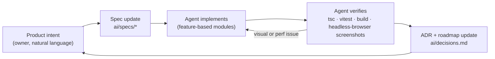

# `ai/` — AI-First Development Hub

**Appa & Queso Bike is an AI-First project.** It was designed, specified, implemented, reviewed and
tuned through an AI-native workflow: a human product owner sets direction in plain language, and
AI coding agents (Claude Code) turn that intent into specs, code, verification and documentation.

This folder is the project's **source of truth for agents and humans alike**. Code follows the
specs; when the product changes, the spec changes first (or in the same commit).

```
ai/
├── README.md        ← you are here: workflow, agent rules, conventions
├── specs/           ← Spec-Driven Development (SDD) suite, one spec per feature area
├── decisions.md     ← Architecture Decision Records (ADRs): what we chose and why
└── roadmap.md       ← prioritised backlog of future features
```

---

## 1. The AI-First loop



1. **Intent** — The owner describes the outcome ("make the bike and cats realistic", "the sides
   feel empty", "add soft ambient music"). No tickets, no pixel specs.
2. **Spec** — The agent maps intent to the relevant spec(s) in `ai/specs/` and updates contracts,
   numbers and acceptance criteria.
3. **Build** — The agent implements in small, typed, feature-scoped modules (see §3).
4. **Verify** — Every change is checked the way a user would experience it, not just compiled:
   - `npx tsc -b` (strict types), `npm test` (Vitest), `npm run build`
   - Headless Chrome screenshots from the gameplay camera **and** from frozen debug cameras
     (side, front, aerial, street level) to inspect geometry, IK contact, lighting, artefacts
   - `renderer.info` draw-call / triangle counts and frame-time sampling
5. **Record** — Non-obvious choices become ADRs in `decisions.md`; ideas go to `roadmap.md`.

## 2. Rules for agents working in this repo

- **Spec first.** If behaviour, numbers or contracts change, update the matching spec.
- **100% offline / zero external APIs at runtime.** No network calls, no remote assets, no
  downloaded media without a verified licence. Prefer procedural generation (see ADR-003, ADR-009).
- **Respect product decisions.** The on-screen "thoughts" / AI dialogue system was removed by the
  owner (ADR-004); don't reintroduce text bubbles or voice lines.
- **Verify visually.** A passing typecheck is not done. Look at the frame. Check for NaN/Inf
  artefacts (they show up as glowing squares after bloom — see ADR-008).
- **Keep it batched.** New scenery must bake through `bakeStatic` (static) or `DynamicBatch`
  (animated). Don't add per-object materials without a reason; measure draw calls before/after.
- **No per-frame allocations** in hot paths (`update()` methods): reuse vectors/matrices.
- **Dispose what you create** (geometries, materials, textures, audio nodes, listeners).
- **Report faithfully.** State what was verified and what wasn't (e.g. "not yet tested on a phone").

## 3. Code conventions

| Area | Convention |
|---|---|
| Structure | Feature-based: `src/features/{game,cat-rider,hud,audio}`, shared helpers in `src/lib` |
| Language | TypeScript strict, `noUnusedLocals`; no `any` except debug hooks (never committed) |
| 3D | Three.js r170, procedural geometry, units ≈ metres, forward = **−Z**, ocean = **+X** |
| React ↔ 3D | React mounts once; the engine runs its own `requestAnimationFrame`; telemetry is throttled to ~12 Hz (Spec 00 §4) |
| Shaders | `onBeforeCompile` injections or small `ShaderMaterial`s; **never `pow()` a value that can be negative** |
| Tests | Vitest for pure math (`*.test.ts` next to the code) |
| Commits | Conventional Commits (`feat(scope): …`, `docs(ai): …`) |

## 4. Spec index

See [`specs/README.md`](specs/README.md).
