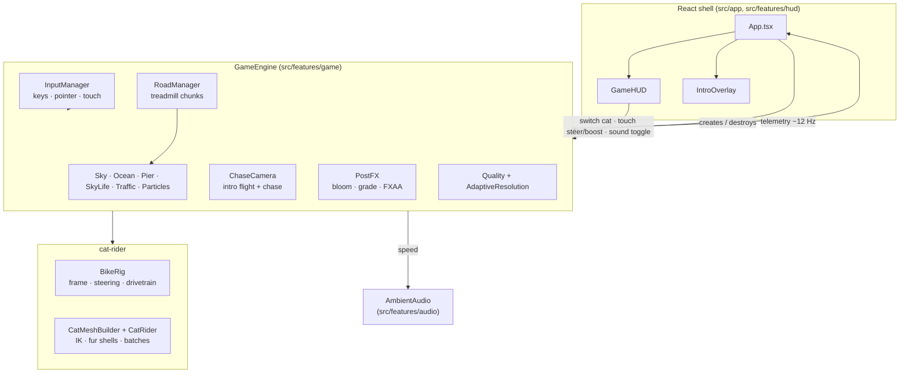

# Spec 00: System Architecture & Engineering Principles

## Status: Implemented
## Feature: System Architecture

---

### 1. Summary & Tenets
**Appa & Queso Bike** is a 100% client-side 3D endless ride along a Southern-California beach at
golden hour, starring two real cats (Appa and Queso). Everything — geometry, textures, sky, ocean,
fur, animation and music — is generated procedurally in the browser.

1. **Zero cloud dependency.** No runtime network calls, APIs or remote assets. The only shipped
   media are the two cat cutout photos used as HUD avatars.
2. **Procedural over downloaded.** Textures (sand, concrete, asphalt, fur, facades), models (bike,
   cats, palms, pier, cars) and audio are generated in code (ADR-003, ADR-009).
3. **Fast loop / React shell split.** The engine owns a native `requestAnimationFrame` loop; React
   only renders the HUD and receives throttled telemetry.
4. **Feature-based, typed modules** with clear contracts between `game`, `cat-rider`, `hud`, `audio`.
5. **Batch everything.** Static scenery is baked per material; animated assemblies are CPU-skinned
   into one draw call per material (Spec 08).

---

### 2. Component Topology



---

### 3. Directory Map

```
src/
├── app/                    # App.tsx (composition), main.tsx (mount), globals.css
├── lib/
│   ├── bakeStatic.ts       # merge static meshes by material (vertex-colour collapse)
│   ├── DynamicBatch.ts     # CPU-skinned per-material batching for animated parts
│   └── utils.ts
├── features/
│   ├── game/               # engine, camera, road, world, post-processing, quality
│   ├── cat-rider/          # bike rig, cat rig, IK math, fur shells
│   ├── hud/                # HUD + intro overlay (React)
│   └── audio/              # generative ambient soundscape (Web Audio)
└── vite-env.d.ts
ai/                         # specs, ADRs, roadmap (AI-First hub)
```

---

### 4. React ↔ Engine Bridge
- React mounts a container `<div>` once; `GameEngine` appends its own canvas.
- The engine never re-renders through React. It exposes callbacks:
  - `onTelemetry(GameTelemetry)` — throttled to ~12 Hz and only when values change.
  - `onCatSwitched(CatId)`, `onIntroChange(playing)`, `audio.onStateChange(enabled, started)`.
- React calls imperative methods: `switchCat`, `skipIntro`, `input.setSteerManual`,
  `input.setBoostManual`, `audio.toggle`.
- `destroy()` tears down the loop, listeners, GPU resources and the audio context (React
  StrictMode mounts twice in development; both instances must clean up fully).

### 5. Acceptance Criteria
1. No network requests after the initial page load.
2. Unmounting the app releases all listeners, GPU resources and audio nodes.
3. The HUD re-renders at telemetry rate, never at frame rate.
