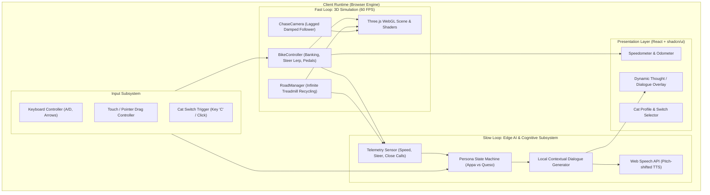

# Spec 00: System Architecture & Engineering Principles

## Status: Approved
## Feature: System Architecture
## Author: Senior AI & Graphics Software Engineer

---

### 1. Executive Summary & Design Philosophy
**Appa & Queso Bike** is a 100% client-side, browser-executable 3D endless runner featuring an autonomous on-device AI cognitive and personality system. 

#### Core Tenets
1. **Zero Cloud Dependency (100% Offline / Edge Execution)**: All 3D rendering, physics simulation, procedural generation, personality logic, and audio synthesis execute directly inside the client's browser (WebAssembly, WebGL, Web Audio, and Web Speech API). No external servers, API keys, or cloud latency.
2. **Decoupled 2-Tier Loop Architecture**:
   - **Fast Loop (60–120 FPS)**: Three.js WebGL scene graph, endless road conveyor recycling, bike kinematic physics, and skeletal paw pedaling.
   - **Slow Loop (0.2–0.5 Hz / Event-Driven)**: Local AI Brain evaluating game state metrics (velocity, road curvature, near misses) to trigger dynamic in-character thoughts and voice lines.
3. **Type-Safe Contract Boundary**: Clear separation of concerns utilizing Feature-Based Architecture (`game`, `cat-rider`, `ai-companion`, `hud`) with strictly typed interfaces.

---

### 2. High-Level Component Topology



---

### 3. Feature Directory Boundaries & Responsibilities

```
src/
├── app/
│   ├── App.tsx               # Top-level composition & HUD overlay
│   ├── main.tsx              # StrictMode React mount
│   └── globals.css           # Tailwind design tokens & CSS variables
├── components/ui/            # Headless shadcn primitives (Button, Card, Badge)
├── features/
│   ├── game/                 # Core 3D engine: canvas, infinite conveyor, chase camera
│   ├── cat-rider/            # Appa & Queso 3D rigs, bike chassis, pedaling animator
│   ├── ai-companion/         # 100% local AI brain, telemetry observer, persona generator
│   └── hud/                  # Game controls overlay, speedometer, dialogue subtitles
├── lib/
│   └── utils.ts              # Classname utilities (cn)
└── vite-env.d.ts             # Ambient declarations
```

---

### 4. Deterministic State Bridge (React <-> Three.js)

To achieve maximum performance, Three.js does **not** re-render through React reconciler passes. Instead:
- React mounts the `<canvas>` once via `useRef<HTMLCanvasElement>`.
- The game loop runs on native `requestAnimationFrame(tick)`.
- Communication from Three.js to React UI occurs via lightweight **Pub/Sub event emitters** or reactive signal stores (e.g. `onSpeedChange`, `onCatDialogue`), ensuring 0 React re-renders during the 60 FPS animation loop.
