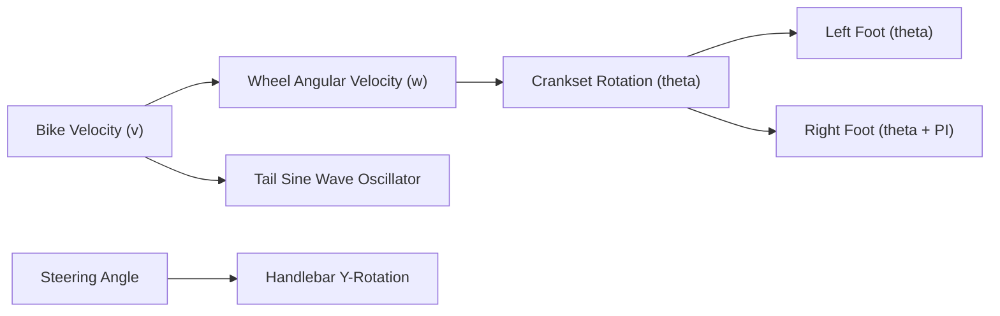

# Spec 02: Cat Rider Entity, Bike Model & Character Switcher

## Status: Approved
## Feature: `features/cat-rider`

---

### 1. Visual & Anatomical Specifications

#### 1.1 Cat Profiles
| Attribute | **Appa** (The Zen Cruiser) | **Queso** (The Chaotic Sprinter) |
| :--- | :--- | :--- |
| **Fur Aesthetic** | Fluffy cream-white with grey accents | Fiery ginger/orange tabby with white bib |
| **Ear Posture** | Relaxed, slightly rounded ears | Sharp, alert, aerodynamic triangular ears |
| **Riding Posture** | Upright, relaxed back, casual paw grip | Leaned forward over handlebars, intense stare |
| **Bike Theme** | Mint cyan / teal metallic frame | Cheddar yellow / flame orange frame |
| **Tail Physics** | Slow, elegant pendular tail swish | Rapid, excited, twitching tail motions |

#### 1.2 The Bicycle Rig Architecture
The bicycle is constructed from optimized procedural Three.js low-poly primitives:
- `FrameGroup`: Diamond frame, seat post, and saddle.
- `SteeringGroup`: Fork, stem, and handlebars (rotates with steering input).
- `FrontWheel` & `RearWheel`: Spokes and tire rim rotating dynamically:
  $$\Delta \theta_{\text{wheel}} = \frac{v_{\text{bike}}}{r_{\text{wheel}}} \cdot \Delta t$$
- `CranksetGroup`: Pedals and crank arms linked to the cat's hind feet.

---

### 2. Pedaling & Kinematic Motion System



1. **Pedal Synchronization**: As speed increases, the crankset rotates proportionally. Left and right rear paws track pedal anchors offset by $\pi$ radians ($180^\circ$).
2. **Handlebar Tracking**: Front paws remain clamped to handlebar grips while the handlebar pivots $\pm 15^\circ$ according to steering intensity.
3. **Dynamic Tail Oscillation**:
   $$\theta_{\text{tail}}(t) = A_{\text{tail}} \cdot \sin(\omega_{\text{speed}} \cdot t) + \text{driftOffset}$$

---

### 3. The Seamless Cat Switcher

#### 3.1 Switching Flow
1. Player clicks the **Switch Cat** UI button or presses the **`C`** key.
2. The `CatSwitcherService` transitions the active cat:
   - A playful visual "poof" particle burst or scale squash/stretch occurs.
   - The inactive cat mesh is toggled invisible; the active cat mesh is toggled visible.
   - The active bike material swaps frame colors (Teal $\leftrightarrow$ Cheddar Yellow).
3. The `ai-companion` receives a `CAT_SWITCHED` event, prompting an instant reactionary voice line (e.g., Queso complaining about Appa's slow pace or Appa wishing Queso would relax).

#### 3.2 TypeScript Contracts

```typescript
export type CatId = "appa" | "queso";

export interface CatProfile {
  id: CatId;
  name: string;
  breedDescription: string;
  themeColor: string;
  bikeColor: number;
  personalityType: "philosophical_zen" | "hyperactive_chaos";
  ttsVoicePitch: number;   // 0.8 for Appa, 1.4 for Queso
  ttsSpeechRate: number;   // 0.95 for Appa, 1.25 for Queso
}

export interface ICatRiderController {
  activeCatId: CatId;
  switchCat(targetId?: CatId): void;
  update(delta: number, speed: number, steerInput: number): void;
  getRootMesh(): THREE.Group;
}
```
