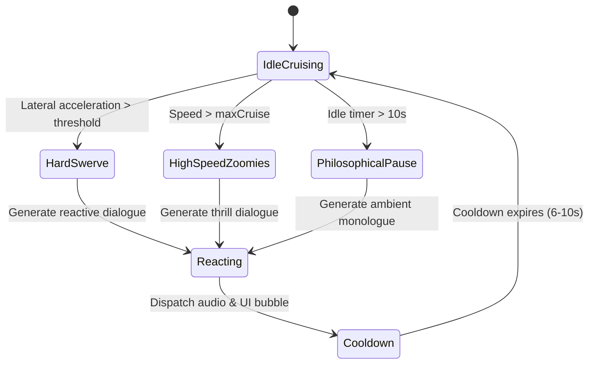

# Spec 03: Edge AI Agent, Dynamic Cat Radio & Commentary

## Status: Approved
## Feature: `features/ai-companion`

---

### 1. Architectural Philosophy: Zero-Cloud Client-Side Intelligence
To satisfy the requirement of **100% offline, zero-external-API execution**, the AI commentary system runs entirely on the browser's JavaScript runtime utilizing:
1. **Context-Aware Semantic Personality Engine**: A rule-weighted generative matrix combining state telemetry, situational context, and emotional valence.
2. **Web Speech API Speech Synthesis**: Hardware-accelerated browser text-to-speech with real-time acoustic modulation (pitch shifting and rate modulation).

---

### 2. Cognitive State Machine & Triggers



#### Trigger Conditions & Priorities
| Priority | Trigger Event | Condition | Appa Example | Queso Example |
| :--- | :--- | :--- | :--- | :--- |
| **P0 (Immediate)** | `CAT_SWITCHED` | Player taps switch | *"Ah, my turn to glide through the breeze."* | *"MOVE OVER APPA, IT'S TURBO TIME!"* |
| **P1 (High)** | `HARD_SWERVE` | $\lvert\text{steer}\rvert > 0.85$ for $> 0.4\text{s}$ | *"Gentle on the handlebars... balance is harmony."* | *"WHOAAAA WE'RE ON TWO WHEELS! DRIFT IT!"* |
| **P2 (Medium)** | `TOP_SPEED` | Speed $> 90\%$ max | *"The wind whispers secrets only cats understand."* | *"FASTER FASTER I SMELL PARMESAN AT THE FINISH LINE!"* |
| **P3 (Ambient)** | `CRUISE_TICK` | Idle timer expires | *"Why do we pedal forward? Perhaps to catch our own tails."* | *"Did you see that squirrel? I'M GONNA BITE IT!"* |

---

### 3. Speech Synthesis & Audio Pipeline

```typescript
export interface VoiceConfig {
  pitch: number;    // 0.1 to 2.0 (Appa: 0.85, Queso: 1.45)
  rate: number;     // 0.1 to 10.0 (Appa: 0.95, Queso: 1.30)
  volume: number;   // 0.0 to 1.0
  lang: string;     // Default "en-US"
}

export class CatAudioSynthesizer {
  private synth = window.speechSynthesis;
  
  speak(text: string, config: VoiceConfig): void {
    if (this.synth.speaking) this.synth.cancel();
    
    const utterance = new SpeechSynthesisUtterance(text);
    utterance.pitch = config.pitch;
    utterance.rate = config.rate;
    utterance.volume = config.volume;
    
    this.synth.speak(utterance);
  }
}
```

---

### 4. Technical Contracts & Interfaces

```typescript
export interface AgentObservation {
  catId: "appa" | "queso";
  speedKmh: number;
  steerAngle: number;
  distanceTraveledM: number;
  lastEvent: "NONE" | "HARD_SWERVE" | "CAT_SWITCHED" | "SPEED_BURST";
}

export interface DialoguePayload {
  speaker: "Appa" | "Queso";
  text: string;
  category: "ambient" | "swerve" | "speed" | "switch";
  durationSeconds: number;
  moodTag: "zen" | "chaotic" | "hungry" | "startled";
}

export interface IAIEngine {
  processTelemetry(observation: AgentObservation): DialoguePayload | null;
  onCatSwitch(newCatId: "appa" | "queso"): DialoguePayload;
  subscribe(listener: (dialogue: DialoguePayload) => void): () => void;
}
```
