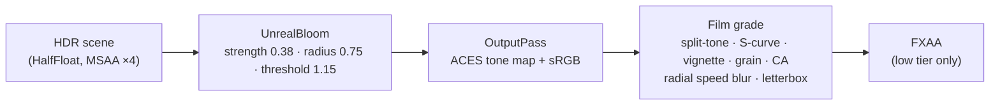

# Spec 08: Rendering Pipeline & Performance Architecture

## Status: Implemented
## Feature: `features/game` (PostFX, QualityManager), `src/lib`

---

### 1. Frame Pipeline

- Lighting: PMREM environment from the procedural sky (intensity 0.6), hemisphere sky/sand
  bounce, low golden directional sun with PCF soft shadows (2048² / 1024² low tier).
- Fog: `FogExp2(#ffc7a2, 0.0068)` matching the sky's horizon haze.

### 2. Batching
| Technique | Where | Effect |
|---|---|---|
| `bakeStatic` | Every road chunk, pier structure, rigid bike/cat sub-assemblies | Merges meshes per material; plain untextured materials collapse into one vertex-coloured material (existing vertex colours preserved) → ~9 draw calls per chunk |
| `DynamicBatch` | Whole cat and whole bicycle | Animated parts stay as invisible drivers; vertices re-transformed into one buffer per material each frame (only parts whose matrix changed) → rider 107 → 29 draw calls |
| Instancing | Seagulls, pelicans, boats, kites, pier pilings, gondolas, traffic | 1 draw call per type |
| Shared variants | Palms (coconut + fan), umbrella canopies | Generated once, reused |

### 3. Quality Tiers (`QualityManager`)
| Setting | High | Low (coarse pointer + small screen, ≤ 4 cores, or `?quality=low`) |
|---|---|---|
| Max pixel ratio | 2 | 1.5 |
| Shadow map | 2048 | 1024 |
| AA | MSAA ×4 | FXAA |
| Fur shells | 10 | 6 |
| Particles | 420 | 160 |

**Adaptive resolution:** an EMA of frame time nudges the pixel ratio down 0.15 when > 21 ms and up
0.1 when < 13 ms (1.5 s hysteresis, clamped to the tier's range).

### 4. Shader Safety Rules (ADR-008)
- Never `pow(x, y)` when `x` can be negative — square by multiplication instead.
- Guard divisions whose denominator can approach 0; clamp `mix()` factors to `[0, 1]`.
- Clamp final sky colour to ≥ 0.

### 5. Acceptance Criteria
1. Budget in Spec 06 holds after any scenery change (measure before/after).
2. No NaN/Inf artefacts from any camera, including the intro flight.
